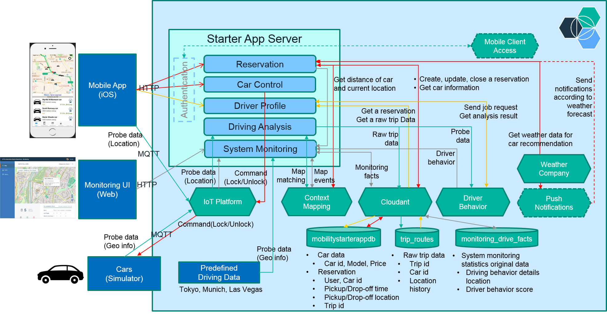

# IBM IoT for Automotive - Mobility Starter Application server

The IBM IoT for Automotive - Mobility Starter Application is a demo app that uses:

1. **Watson IoT Platform**
2. **Context Mapping**
3. **Driver Behavior**
4. other services on **IBM Bluemix** to help you to quickly build a smart car sharing automotive solution.

## Overview

The starter app provides a mobile app for customers to quickly find and hire a car without human intervention from a car-hire company. The server component provides features that can help car hire companies manage a pool of cars and to get insights into customer usage and requirements that can also help to attract and retain customers.

## Server component

The server component provides the back-end car sharing and system monitoring services. Car-hire companies can use the server component features to do the following car-hire operations tasks:

- Monitor the location of all cars in the hire pool on a [Geographic Information System (GIS) map](https://en.wikipedia.org/wiki/Geographic_information_system)
- View detailed information about each vehicle and its current status
- View and manage customer information
- Evaluate and score customer driving behavior

### Mobile app

Customers who want to hire a car can use the Mobility Starter Application mobile app to search for available cars that are nearby, reserve a car, unlock the car, and then start driving the car. While you drive the car, the service tracks your location and also records your driving behavior. When you reach your driving destination, you can view information about each trip that you took in the car and you can also view your driving behavior score. You can also see how this new type of service generates vehicle data that helps automotive companies attract and retain customers.

For more information about the mobile app for either iOS or Android devices, see [Deploying the mobile app](#deploy_mobile_app).

The Mobility Starter Application server demonstrates how quickly you can build a car sharing solution on Bluemix by using the following services:

   * [IBM Watson IoT Context Mapping](https://console.ng.bluemix.net/catalog/services/context-mapping/)
   * [IBM Watson IoT Driver Behavior](https://console.ng.bluemix.net/catalog/services/driver-behavior/)
   * [IBM Watson IoT Platform](https://console.ng.bluemix.net/catalog/services/internet-of-things-platform/)
   * [Cloudant NoSQL DB](https://console.ng.bluemix.net/catalog/services/cloudant-nosql-db/)
   * [Weather Company Data for IBM Bluemix](https://console.ng.bluemix.net/catalog/services/weather-company-data-for-ibm-bluemix/)
   * [Push Notifications](https://console.ng.bluemix.net/catalog/services/push-notifications/)
   * [Mobile Client Access](https://console.ng.bluemix.net/catalog/services/mobile-client-access/)

## Deploying the Mobility Starter Application server on Bluemix

You can automatically deploy an instance of the Mobility Starter Application server on Bluemix by clicking [](https://bluemix.net/deploy?repository=https://github.com/ibm-watson-iot/iota-starter-server.git). You can also deploy the app manually. Note that you have to do the service activation step mentioned below after the automatic or manual deployment.

To manually deploy your own instance of the Mobility Starter Application server on Bluemix, complete all of the following steps:

1. Register an account on Bluemix or use an existing valid account.

2. Download and install the [Cloud-foundry CLI][cloud_foundry_url] tool.

3. Clone the Mobility Starter Application app to your local environment by using the following Terminal command:

  ```sh
  $git clone https://hub.jazz.net/project/thomas.suedbroecker/iota-starter-server-tsuedbro/overview
  ```
4. Change to the directory that you just created.

5. Edit the `manifest.yml` file and change the values of `<name>` and `<host>` to something unique.

  ```javascript
  applications:
         :
    disk_quota: 1024M
    host: <name>
    name: <host>,
    path: .
    instances: 1
    memory: 640M
         :
  ```
  The host value is used to generate your application URL, which is in the following syntax:
  `<host>.mybluemix.net`.

6. Edit the `package.json` file and change the values of `<name>` to name of the application.

   ```javascript
     "name": "<name>",
     "version": "1.3.2",
   ```

7. Edit the `docs/push-and-log.sh`, `docs/push-setup.sh`, `docs/restage-and-log.sh` and `docs/deploy_create_services`  files and change the values of `<bluemix-id>`, `<bluemix-organization-name>`, `<bluemix-space-name>` and `<bluemix-application-name>` to your needs.

   ```javascript
      user="<bluemix-id>"
      # bluemix_api="https://api.eu-gb.bluemix.net"
      bluemix_api="https://api.ng.bluemix.net"
      organization_name="<bluemix-organization-name>"
      space_name="<bluemix-space-name>"
      application_name="<bluemix-application-name>"
   ```

8. By using the command line to enable the bash scripts for execution.

   ```sh
   $ cd docs
   $ chmod u+x init-bash-scripts.sh
   $ ./init-bash-scripts.sh
   ```

9. Using the command line to run the bash setup. Follow the written instructions during the execution.

    ```sh
    $ cd docs
    $ ./init-sample-bluemix-cf-application.sh
    $ --> This script will create the needed Bluemix Services and the Bluemix CF Node JS Application
    $ -> Start Setup IoT for Automotive Sample
    $ -> Start creating the Bluemix Services
    ...
    $ Insert your password:
    $ *******
    ...
    $ --> Create Bluemix Service - DONE!
    $ --> Ensure to deploy into the right bluemix region
    $ -> Start setup
    ...
    $ Insert your password:
    $ *******
    ...
    $ ->Set ADMIN USER and PASSWORD
    $ ->Choose a administration user:
    ADMIN
    $ ->Choose a administration user password:
    ADMIN
    $ ->***************
    $ ->Now you must:
    $
    $ Activating the bluemix services
    $ Before you can use the application you must activate the Context Mapping and Driver Behavior services on Bluemix, as outlined in the following steps:
    $  Make sure that the app is not running on Bluemix.
    $   1-Open the Bluemix dashboard in your browser.
    $   2-Open the Context Mapping service and wait for a few seconds until your credentials display.
    $   3-Open the Driver Behavior service.
    $  
    $  Did you finish this tasks: Y/N
    $  Y
    ...
    $  -> First Setup is DONE!
    $  -> There are remaining steps to do!
    ```

## Alternative do these manual steps

1. Create an instance of Watson IoT Platform, Context Mapping, and Driver Behavior services on Bluemix.

  ```sh
  $ cf create-service iotf-service iotf-service-free IoTPlatform
  $ cf create-service mapinsights free ContextMapping
  $ cf create-service driverinsights free DriverBehavior
  ```

2. Create an instance of the Cloudant NoSQL DB and the Weather Company Data services on Bluemix.

  ```sh
  $ cf create-service cloudantNoSQLDB Lite MobilityDB
  $ cf create-service weatherinsights Free-v2 WeatherInsights
  ```

3. Push the app to Bluemix. As you will need to complete further steps when the app is deployed, be sure to use the **--no-start** argument by using the following push command:

  ```sh
  $ cf push --no-start
  ```

You now have your very own instance of the IoT for Automotive - Mobility Starter Application on Bluemix.  

To run the car sharing Mobility Starter Application you need to install the mobile app and connect it to your server instance. You must also activate the IoT for Automotive services on Bluemix that you created earlier when you deployed your server instance and then complete the optional configuration steps.


## Deploying the mobile app

After deploying the server component, to simulate and run the starter experience, you need to install a mobile app. The mobile app is available for both iOS and Android devices.

- To access the mobile app source code and deployment instructions for iOS, see [iota-starter-carsharing](https://github.com/ibm-watson-iot/iota-starter-carsharing).

To play a demo of the app, see the [Starter Experience home page](https://iot-automotive-starter.mybluemix.net).

I this project the iOS Mobile code is in this project.
**mobile-app-ios-carsharing** .

To setup the project you call the **docs/setup-ios-mobile-app.sh** from the commandline.
This will open the xCode workspace.

  ```sh
  $ ./setup-ios-mobile-app.sh
  ```
To configure the **PUSH** you need to change the bundle ID **com.ibm.iot.automotive.starter.carsharing** to your needs and you need the two Mobile Services **"PushNotifications and Mobile Client Access"** connected to your server application.

Also you need to change **ConnectedDriverAPI/API.swift** file variables based on your Bluemix Services
  ```
    static let defaultAppURL = ""                // Your Bluemix Application URL
    static let defaultPushAppGUID = ""           // Your PushNotifications Service
    static let defaultPushClientSecret = ""      // Your PushNotifications Service
    static let defaultMcaTenantId = ""           // Your AdvancedMobileAccess Service
    static var bmRegion = BMSClient.Region.usSouth
    static var customRealm = "custauth"
  ```
Also follow the steps written here:

1. [Setting up push notifications](https://github.com/ibm-watson-iot/iota-starter-carsharing#setting-up-push-notifications)
2. [Mobile Client Access service](https://github.com/ibm-watson-iot/iota-starter-carsharing#mobile-client-access-service)

### Activating the services

Before you can use the application you must activate the **Context Mapping** and **Driver Behavior** services on Bluemix, as outlined in the following steps:

1. Make sure that the app is not running on Bluemix.

2. Open the [Bluemix dashboard][bluemix_dashboard_url] in your browser.

3. Open the **Context Mapping** service and wait for a few seconds until your credentials display.

4. Open the **Driver Behavior** service.

### Manual setup the Push Notifications service

You can enable push notifications when the weather at the drop off time of your car reservation becomes bad. Complete the following steps to enable push notifications:

1. Start a browser and open the [Bluemix dashboard][bluemix_dashboard_url].

2. Open the app that you created.

3. Click **ADD A SERVICE OR API**.

4. From the catalog, select **Push Notifications**.

5. Click **CREATE**.

6. Open the push notifications service that you just created.

7. Click **Setup Push**.

8. Register your Apple Push Notification Service certificate as outlined in [Configuring credentials for Apple Push Notifications](https://console.ng.bluemix.net/docs/services/mobilepush/t_push_provider_ios.html).


### Manual setup of the Mobile Client Access service

The Mobililty Starter Application provides a simple custom authentication service that you can optionally use. To use the service, configure the Mobile Client Access service for Bluemix and enable the authentication.

1. Start a browser and open the [Bluemix dashboard][bluemix_dashboard_url].

2. Open the app.

3. Click **ADD A SERVICE OR API**.

4. In the catalog, select Mobile Client Access.

5. Click **CREATE**.

6. Open the Mobile Client Access service that you just created.

7. Under **_Custom_**, click **_Configure_**.

8. Enter the following authentication credentials:
-  __Realm name__ : `custauth`  
-  __Custom Identity Provider Url__ : `https://<host>.mybluemix.net`

9. Click **Save**.

10. Go to your [Bluemix dashboard][bluemix_dashboard_url] and open the app.

11. Click ** _Environment Variables_**.

12. Click **USER-DEFINED**.

13. Add the following variable and then save it.  
-  __Name__ : `MCA_AUTHENTICATION`  
-  __Value__ : `true`

After you enable the authentication, you can log in to the app with any user name and password credentials.

For more information, see [Configuring Mobile Client Access for custom authentication](https://console.ng.bluemix.net/docs/services/mobileaccess/custom-auth-config-mca.html).

## Running the app

- To start your Mobility Starter Application instance, open the [Bluemix dashboard][bluemix_dashboard_url] and start the app.

Congratulations! You are ready to use your own instance of the IoT for Automotive Starter app. Open `http://<host>.mybluemix.net/monitoring/#/settings` in your browser and follow the instructions in the mobile client connection section to connect your mobile app to the IoT for Automotive - Mobility Starter Application.

## Connecting your own devices to the app

When you start your mobile app, you might see some simulated cars plotted at the current location on the map. The simulated cars are  generated automatically by the simulation engine that is provided by the app. Instead of using the simulated cars, you can connect and register your own physical devices to the app by using the following instructions.

### Disabling the simulation engine

Your physical devices can coexist with the simulated cars in the app. You can disable the simulated cars if you prefer.

1. Go to your [Bluemix dashboard][bluemix_dashboard_url] and open the app.

2. Stop the app.

3. Click **_Environment Variables_** in the left bar.

4. Click **USER-DEFINED**.

5. Insert `DISABLE_DEMO_CAR_DEVICES=true` and save the change.

6. Restart the app.

### Registering your device

To display your device on a map on the mobile app, register your device by completing the following instructions:

1. Start your browser and open `http://<host>.mybluemix.net/admin/ui/device`.

2. Enter your credentials and click **_OK_**. By default, the credentials are ADMIN/ADMIN.

3. If you see simulated cars in the list, you can delete them.  A device type for simulated cars is __ConnectedCarDevice__.

4. Click **_Create_**.

5. Complete the required fields on the form and then click **_Create_**.

  Specify a unique ID that identifies your device, for example, a MAC address. If you do not enter a device ID, an 8-digit ID will be generated automatically.

6. Go back to the list page and confirm that your car name and photo displays in the list.

Credentials for vehicle management page are set to ADMIN/ADMIN by default. However, they can be changed by setting the following environment variables:
```
ADMIN_USER=<administrator name>
ADMIN_PASSWORD=<administrator password>
```

To create trip data, your connected sensor device must publish car probe data to Watson IoT Platform. Car probe data includes information about the driving trip, for example, location and speed. If your device is registered successfully, it is added to Watson IoT Platform with the device type __UserOwnedCarDevice__.

You can also add your device to Watson IoT Platform directly. For more information, see the following resources:
 * [Quickstart](https://quickstart.internetofthings.ibmcloud.com/)
 * [How to Register Devices in IBM Watson IoT Platform](https://developer.ibm.com/recipes/tutorials/how-to-register-devices-in-ibm-iot-foundation/)


### Connecting your device to Watson IoT Platform

When your device is registered to your Watson IoT Platform instance, your device can connect to Watson IoT Platform and send car probe data by using the credentials that are assigned to your device. Lightweight API commands are provided with the app.

To simplify configuration and retrieve the credentials, you can use the following API command:
```
GET /user/device/credentials/:deviceId
```
**Notes:**
- To call the API from your device, you must disable the Mobile Client Access service.
- The **deviceId** value is the ID that is assigned to the device. If you did not register your device by using the above step, the API will register your device automatically with the specified ID and returns the credentials for the device. In this case, the default car values, for example name, photo, and car model, are assigned automatically. The default name is __User owned car__.

### Modifying car details

To modify car information, complete the following steps:

1. From your browser, open `http://<host>.mybluemix.net/admin/ui/device`.

2. Enter the credentials when prompted and then click **_OK_**. By default, the credentials are ADMIN/ADMIN.

3. Click your device ID to open the car details page.

4. Modify the required values and then click **_Update_**.

5. Go back to the list page and confirm that your car name and photo were updated correctly.

### Data format

Your device must publish car probe data to the Watson IoT Platform in the following data format.

```
{
  "d": {
    "lat": <latitude in double>,
    "lng": <longitude in double>,
    "trip_id": "<trip id in string>",
    "speed": <vehicle speed in double (km/h)>
  }
}
```
The `lat` and `lng` values are required to plot and display the location of your car on a map in the mobile app. Set the `lat` and `lng` values to match your device location. When you record your trip route after you reserve the car, the `trip_id` and `speed` values are also required. The value of `trip_id` must match the value that you set during the reservation.

### Create trip data with your device

To create trip data for your device, complete the following steps:

1. Connect your device to Watson IoT Platform.

2. Start sending the latest location data from the device. Keep sending the location data at short intervals.

3. Start the mobile app and show the current location on a map. Note that the device must be located at the same location.

4. Select your car and reserve it on the mobile app.

5. Unlock the car on the mobile app.

6. Generate unique trip id on the device and send it along with real-time location and speed data at short intervals.

7. Start driving with the device.

8. Stop driving. Stop sending the trip_id from the device.

9. Lock the car and complete the reservation on your mobile app.

You can see your trip route on Trips tab and driving behavior on Profile tab. It may take some minutes to analyze your trip data.

### Using the mobile app to create trip data

If you reserve a simulated car and unlock it on the mobile app, the simulated car starts running automatically around the location until the reservation is completed. You can see the simulated trip route and associated driving behavior on the mobile app after you complete the reservation.

The mobile app also provides capabilities to send car probe data. Therefore, instead of your own sensor device, you can use the mobile app to record your trip data easily without requiring the complex device settings that are described above. Select the _Analyze My Driving_ option at the top page of the mobile app. The mobile app registers itself to the Watson IoT Platform and starts sending car probe data. And, by driving around with your iOS or Android mobile device, data from your mobile app are recorded and analyzed in the app.

## Implementation

The following diagram shows the components that are used by the car sharing Mobility Starter Application and the flows that exist between the components. 	



* **Reservation** handles a request related to a reservation. The [routes/user/reservation.js](routes/user/reservation.js) component contains  the implementation.
* **Car Control** gets a request for controlling a car device, for example, to lock or unlock a car. It sends a command to the target car through Watson IoT Platform. The [routes/user/reservation.js](routes/user/reservation.js) component contains implementation for /carControl end point.
* **Driver Profile** handles a request to access a driver's behavior by using Driver Behavior service. The [routes/user/insights.js](routes/user/insights.js) component defines the end point and the  [driverInsights/analyze.js](driverInsights/analyze.js) component contains the implementation.
* **Driving Analysis** gets events containing probe data from registered cars through Watson IoT Platform. It then sends the probe data to the Context Mapping service to get the corrected location and sends the corrected location to the Driver Behavior service to get the driver's behavior. The [driverInsights/probe.js](driverInsights/probe.js) component is the entry point to explore the implementation. It also stores the probe data to Cloudant database "trip_route" that is used to retrieve a trip route. For more information, see the  [driverInsights/tripRoutes.js](driverInsights/tripRoutes.js) component.
* **Monitoring System** provides a dashboard showing real-time information about cars and reservations, and information about driver's behaviors extracted from probe data by Driver Behavior service. The Map page pulls car status and reservation information via HTTP requests, and also receives car probe events relayed by IoT Platform via Web Socket connection. The page aggregates those informations to visualize the real-time state of cars on a map. The Users page shows statistics of driving behaviors associated to users' reservations. The server side implementation periodically, every two hours by default, extracts driving behavior information from the __Reservation__ and the __Driver Profile__ components and caches them to a database. The page gets the statistics from the database via HTTP requests. The implementation includes static files in [public/monitoring](public/monitoring) folder and server-side implementations in [routes/monitoring](routes/monitoring) folder which provides the end points and data synchronization.

* **Simulated Driving Data** is preset driving data under the [devicesSimulation/data](devicesSimulation/data) folder. The data is passed to Driving Analysis directly in [devicesSimulation/simulationImporter.js](devicesSimulation/simulationImporter.js) that is called in [_app.js](_app.js).
* **Cars (Simulator)** simulates different types of car behaviors. The implementation is under the  [devicesSimulationEngine](devicesSimulationEngine) folder.

## Reporting defects
To report a defect with the IoT for Automotive - Mobility Starter Application server component, go to the [Issues](https://github.com/ibm-watson-iot/iota-starter-server/issues)) section.

## Troubleshooting
To debug problems, check the Bluemix app logs. To view the logs, run the following command from the Cloud Foundry CLI:

  ```
  $ cf logs <application-name> --recent
  ```
For more detailed information on troubleshooting your application, see the [Troubleshooting section](https://www.ng.bluemix.net/docs/troubleshoot/tr.html) in the Bluemix documentation.

## Privacy Notice

The IoT for Automotive Starter app includes code to track deployments to [IBM Bluemix](https://www.bluemix.net/) and other Cloud Foundry platforms. During each deployment, the following information is sent to a [Deployment Tracker](https://github.com/cloudant-labs/deployment-tracker) service:

* Application Name (`application_name`)
* Space ID (`space_id`)
* Application Version (`application_version`)
* Application URIs (`application_uris`)
* Labels of bound services
* Number of instances for each bound service

The tracked data is collected from the `VCAP_APPLICATION` and `VCAP_SERVICES` environment variables in IBM Bluemix and other Cloud Foundry platforms. The data is used by IBM to track metrics around deployments of sample applications to IBM Bluemix to measure the usefulness of our examples, so that we can continuously improve the content that we offer to you. Only deployments of sample applications that include code to ping the Deployment Tracker service are tracked.

### Disabling Deployment Tracking

You can disable the Deployment Tracking feature by removing `require("cf-deployment-tracker-client").track();` from the beginning of the `app.js` main server file.

## Useful links
[IBM Bluemix](https://bluemix.net/)  
[IBM Bluemix Documentation](https://www.ng.bluemix.net/docs/)  
[IBM Bluemix Developers Community](http://developer.ibm.com/bluemix)  
[IBM Watson Internet of Things](http://www.ibm.com/internet-of-things/)  
[IBM Watson IoT Platform](http://www.ibm.com/internet-of-things/iot-solutions/watson-iot-platform/)   
[IBM Watson IoT Platform Developers Community](https://developer.ibm.com/iotplatform/)

[bluemix_dashboard_url]: https://console.ng.bluemix.net/dashboard/
[bluemix_signup_url]: https://console.ng.bluemix.net/registration/
[cloud_foundry_url]: https://github.com/cloudfoundry/cli
[mobile_app_readme]: https://github.com/ibm-watson-iot/iota-starter-carsharing/blob/master/README.md
